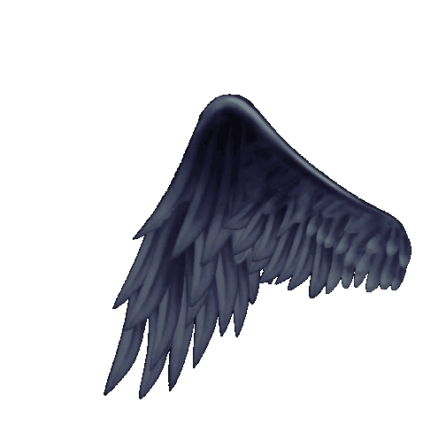

 

[//]: # ()
<!--

-->

<!--

<h2> Hi, Welcome👋 I'm Ratkovski! </h2>

[//]: # ()

-->

<h2></h2>

<!-- https://myoctocat.com/build-your-octocat/ -->

 

   

  
 

🔭 I'm currently a backend software developer

🌱 I’m currently learning **JAVA, AWS, PYTHON, INFORMATION SECURITY**

👨‍💻 My projects can be seen here [repositórios](https://github.com/Ratkovski?tab=repositories)

📚 Amazing repositories for your studies ⬇️ ⬇️ ⬇️

   [Books](https://github.com/cjbt/Free-Algorithm-Books/tree/master/book)
   
   [Clean Code Notes](https://github.com/JuanCrg90/Clean-Code-Notes#chapter1)
   
   [Universidade Live - Cursos](https://github.com/Universidade-Livre/ciencia-da-computacao)
   
   [Guia Extenso de Programação](https://github.com/arthurspk/guiadevbrasil)
   
   [Free Educa](https://github.com/free-educa)

 📚 Amazing sites for your studies ⬇️ ⬇️ ⬇️

 [Notes for professionals](https://books.goalkicker.com/)

 [Roadmap](https://roadmap.sh/)

 [Profissional em T](https://techguide.sh/)

 [Dev Docs](https://devdocs.io/)
 

 

 

<h2 align="center"> 🔧 Languages and Tools</h2>

  
   
  
   
   
   
   
   

 

 

## My Stats

<!-- https://github-readme-streak-stats.herokuapp.com/demo/ -->

[//]: # ()
[//]: # (![Ratkovski's github stats]&#40;https://github-readme-stats.vercel.app/api?username=Ratkovski&show_icons=true&theme=tokyonight&#41;)

[//]: # (<a  href="https://awesome-github-stats.azurewebsites.net/index.html??cardType=octocat&theme=tokyonight"> )

[//]: # (    </a>)

<!-- https://github-profile-summary-cards.vercel.app/demo.html -->
 
[//]: # ()
[//]: # (| ![]&#40;http://github-profile-summary-cards.vercel.app/api/cards/stats?username=Ratkovski&theme=nord_dark&#41; | ![]&#40;http://github-profile-summary-cards.vercel.app/api/cards/repos-per-language?username=Ratkovski&hide=Html&theme=nord_dark&#41; | ![]&#40;http://github-profile-summary-cards.vercel.app/api/cards/most-commit-language?username=Ratkovski&theme=nord_dark&#41; |)

[//]: # (| :-: | :-: | :-: |)

[//]: # ()
[//]: # (| ![]&#40;http://github-profile-summary-cards.vercel.app/api/cards/profile-details?username=Ratkovski&theme=nord_dark&#41; | ![]&#40;https://github-readme-streak-stats.herokuapp.com/?user=Ratkovski&hide_border=true&date_format=M%20j%5B%2C%20Y%5D&background=2D3742&stroke=2D3742&ring=6bbbca&fire=6bbbca&currStreakNum=fff&sideNums=6bbbca&currStreakLabel=6bbbca&sideLabels=fff&dates=fff&#41; |)

[//]: # (| :-: | :-: |)
 
 
 

[//]: # (![]&#40;http://github-profile-summary-cards.vercel.app/api/cards/profile-details?username=ratkovski&theme=dark&#41;)

[//]: # ()
[//]: # (![]&#40;http://github-profile-summary-cards.vercel.app/api/cards/repos-per-language?username=ratkovski&theme=dark&#41;![]&#40;http://github-profile-summary-cards.vercel.app/api/cards/most-commit-language?username=ratkovski&theme=dark&#41;)

[//]: # (![]&#40;http://github-profile-summary-cards.vercel.app/api/cards/stats?username=ratkovski&theme=dark&#41;![]&#40;http://github-profile-summary-cards.vercel.app/api/cards/productive-time?username=ratkovski&theme=dark&utcOffset=8&#41;)

## Visitors

